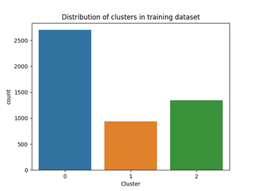
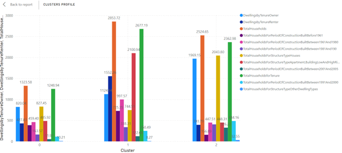

# Census tract income forcast
### Canadian Census Tracts (CTs) clustering analysis and income level forecasting
### Executive summary
The goal of the study was to use the training dataset to find the group of demographic traits that can most accurately predict the median household income (in dollars per year) for census tracts and make predictions about the annual median household income for each census tract in the test dataset. It was achieved in several steps, started by an exploratory data analysis on the variables, including removing error rows and highly correlated variables. Then, we grouped the census data into 3 different clusters using unsupervised learning algorithms, since areas with vastly varying levels of development may have different prediction models. The Elbow method, the Silhouette method, and Pseudo-F Method were applied to find the best K. Then we applied supervised learning and compared 4 types of models – K-Nearest Neighbor, Linear Regression, CART, and Neural Network to find the best method for median household income prediction in each of the 3 clusters. To further improve the model performance, we found the corresponding best subset based on the models we selected and achieved the highest R square possible. The predictive model can be applied in diverse fields such as advertisement, government, and research organizations for multiple purposes.
### Introduction
The raw data we retrieved concern Census tracts (CTs), which are modest, geographically stable areas with a typical population of 2,500–8,000 persons. CTs are typically found in census agglomerations (CA) and census metropolitan areas (CMA) with a core population of 50,000 or more, as determined by local experts and Statistics Canada. After a CMA or CA has been partitioned into CTs, the CTs are kept even if the core population eventually falls below 50,000. Our goal was to find the group of demographic traits that can most accurately predict the median household income (in dollars per year) for CTs and use them to make predictions about future annual median household income for each census tract.
There are two available datasets for this analysis, the first contains 5,000 CT records and will be used to train the model and the second data set contains 721 rows and will be used to evaluate the accuracy of the predictions. To ensure the prediction accuracy, we start by grouping the census data into different clusters using unsupervised learning algorithms, since areas with vastly varying levels of development may have different prediction models. Then we apply supervised learning and compare models to find the best method for median household income prediction. The details of the method will be explained in the following sections along with visualizations. Findings, summary of the study, and potential applications of the predictive model will be given at the end of this report.
### Exploratory Data Analysis
In the training dataset, each row represents 1 CT record, which includes 14 demographic characteristics as input variables and the median household income as the output variable. The test dataset has the same 14 attributes and is missing the output. All variables are numeric, and no additional columns are created in either dataset. Based on the data feature, the 14 inputs are categorized into 4 data groups: Basics, Occupied Private Dwellings by Period of Construction, Occupied Private Dwellings by Structure Type, and Occupied Private Dwellings by Tenure. For each of the last 3 groups, there is one variable indicating the sum of all the other variables inside the same group.
During the data cleaning process, 20 rows where total household or total population are 0 are dropped since they do not provide useful information for prediction. We also carried out a correlation analysis (Figure 1) and a multivariate analysis (Figure 2), where we noticed that the correlation coefficient of most of the variable pairs is less than 0.5. However, Total Population is found to be highly correlated with multiple variables, such as Total Households, Total Households for Period of Construction, Total Households for Tenure, and Dwellings by Tenure Owner. Besides, Total Households and Total Households for Period of Construction are identical. Therefore, Total Population and Total Households for Period of Construction are not selected for modelling (Table 1). 

### Clustering
In order to better understand the characteristics of each census tract, we conduct a K-means clustering with three methods. The elbow method suggests we choose K=3 where the curve drops sharply. When k is bigger than 3, the curve is smoother,  which indicates there is no further information stated if the K is larger than 3.

We also conduct a silhouette analysis to justify the previous results. Silhouette analysis examines how close each point in one cluster is to points in the neighboring clusters and thus provides a way to assess parameters like number of clusters visually. From the graph, it is obvious that when K = 3 , the distance between clusters is the biggest. 

Pseudo-F describes the ratio of between cluster variance to within-cluster variance. Our target is to minimize the variance of within-cluster variance, thus we would like to choose a high Pseudo-F value. In this case, when the K is 3, the Pseudo-F value is the highest.

After conducting a clustering model with K = 3, we examine the distribution of the data in the training dataset and test dataset. The outcome shows that the pattern of data is similar in two datasets, which verifies our algorithm.

Let us take a deeper look at the composition of the clusters. In cluster 0, we can see that the total households are relatively small compared with the other two clusters. Moreover, the Distribution of income by cluster also shows that in cluster 0, people tend to have low income as the majority of people have a median income of roughly $50000. Around 62% of the maisons in cluster 0 are houses, which requires big spaces. Thus we conclude that cluster 0 portrays the characteristics of people living in the suburb. Iin cluster 1, we can see that the majority of the house type is High rise, and most people are having a median income of 100,000 per year. We could infer that in this cluster, people are living in urban areas like downtown and have a relatively high living standard. For cluster 2, it also has a high total households count, and the majority of the house type is house. The median income in cluster 2 has a very high range, which overlaps the cluster 0 and cluster 1. A very special distribution in cluster 2 is that most of the houses are dwelled by tenure owners. We could infer that people in this cluster are mostly living in midtown areas where houses are not for investing purposes.

### Birch Clustering
We also conduct a birch analysis with the number of clusters equals to 3, branching factor equals to 30 and threshold equals to 0.2. The result is as follows. We can see that cluster 0 this time has a big range of income while cluster 1 and cluster 2 have a much smaller size compared with cluster 0. In total 3601 data is classified to cluster 0, 830 to cluster 1 and 549 to cluster 2. From the box plot, we can see that the difference between clusters are not as obvious as K means clustering, thus we finally decide to apply the K means clustering method to the training dataset.

### Model Selection
From the previous EDA section, we saw that these 3 clusters have very different characteristics. Because of this, trying to fit a universal prediction model on all training data would be suboptimal and probably will not perform well when it is used in later predictions. If we think of it from a more intuitive way, a census tract located in the urban area of Toronto obviously should not be fed into the same model that is being used to predict the average income of rural neighborhoods in northern Alberta. Due to this concern, we believe that our model selection process should be performed independently on each of these 3 clusters.
However, before jumping right into the model selection process, we would first like to discuss a common alternative that also takes into account the clustering issue of the observations. Intuitively, with clustered data, one might think it is a good idea to create a new categorical feature called cluster using all the clustering information and use that as an additional predictor to train the model. However, although this approach does take into account the information of their clusters, we are still constrained to using the same model and the same set of features for all the data. When the distances between clusters are relatively close, this method can be used as a reliable way to improve model performance, but when the clusters are further apart, treating them as independent datasets might be the better choice.
The model selection process started with splitting the training dataset into a new training set and a testing set. The training dataset will be used to train the models as well as tune them in order to find the best hyperparameters, and the test dataset will be used to evaluate different models’ performance (R2 is used as the goodness of fit indicator). Four different algorithms were tested on each of the 4 clusters, and the following table illustrates the models used and their respective R2.

All of these models, except linear regression, were tuned using 10-fold cross-validation, and their best hyperparameters for each cluster were shown in the last row of the table. Linear regression does not have hyperparameters, and for CART and Neural Network, the hyperparameters are the same for all the 3 clusters. Data were normalized with a standard scaler for KNN and Neural Network before training.
As we can see, in Cluster 0, the KNN model stood out at the top, providing an r2 of 0.3903, while in Clusters 1 and 2, Linear Regression outperformed the others. This result should not be too much of a surprise to us since we know that KNN is a parametric algorithm that could perform really well if tuned correctly, as it does not assume function forms of the data. However, one critical downside of KNN is that its performance can suffer when there is insufficient data. As the number of features increases, the required amount of data in a KNN model increases quadratically, this is sometimes referred to as the “Curse of Dimension.” Since cluster 0 is the most populated cluster containing the most observations, KNN outperforms the others, and when the number of observations is lower, such as in clusters 1 and 2, the linear model comes on top. 
### Feature Selection
As we have briefly discussed in the model selection section, a downside of our cluster-and-predict is that we are essentially dividing our total dataset into several smaller datasets, which would inevitably result in fewer data available for each model to fit on. Algorithms such as KNN suffer significantly from the “Curse of Dimension” when there are not enough data to use and will produce a much higher test error, as the model is not well fitted (High bias error). Although we cannot arbitrarily increase the number of observations that we have on hand, what we can do, however, is to reduce the number of features to use in our model and improve the column-row ratio. 
There are many dimension reduction methods available for this job; some of the most popular ones are stepwise selection, Lasso, and Principal components analysis(PCA). Most of these algorithms use some sort of feature selection method, such as stepwise selection, penalized terms, etc. Their performance’s upper bound is the best subset method, where we simply try out all the possible combinations of the features and see which feature set yields the best result. Because of this, the best subset result forms the upper bound of all these approximation methods. The downside of the best subset method is also apparent: it is very computationally heavy. In fact, for a dataset with more than 20 features, there are more than a million combinations, and very often, it is impossible to compute all of them. Luckily, our dataset has only 12 predictors, so it is possible to use the brute force best subset method to select our features. 
In the best subset calculation, we used both the KNN model and the linear regression to test out the performance of each set of features. They are selected as they are the top performers in the previous model selection stage. The best subset results for each of the 3 clusters are shown here:

As we expected, when the number of features decreases, the performance of KNN improves significantly and overtakes linear regression in terms of R2 performance for both Cluster 1 and 2. 
### Summary
Final models selected for the 3 clusters are 3 different KNN models with different hyper-parameters k. However, although KNN is used for all 3 clusters, these models fit independently using the data of the 3 clusters and, thus, are very different and should not be mixed up. Together with the clustering model that we trained previously, we now have our final model set, which can be used to predict the median household income of a particular census tract, with r2 ranging from 35.7% to 49.6%, depending on the cluster of the new observation. 
In order to use the model to conduct future predictions, we first need to input the new observation CT into our clustering model to classify it into one of the 3 clusters, and depending on its cluster, we can then use the corresponding KNN model to predict its income. 
